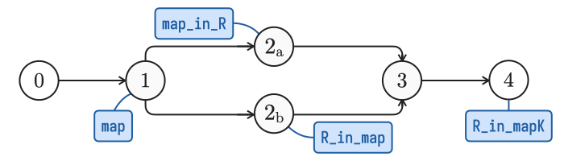

# Trocq tutorial

This tutorial is an introduction to Trocq, covering several examples from the repository from the user's point of view.
First, we present the use of Trocq to perform proof transfer along type equivalence relations.
Then, we handle the case of weaker, directed relations.
Finally, we give several examples of multiple transfer featuring polymorphic and dependent containers.

## Proof transfer with type isomorphisms

In this first section, we show two examples of isomorphisms: natural numbers with unary and binary representations, and bitvectors.

?> Here, we also introduce details about the internals of Trocq relations, so that users understand better what they contain and how they are built and declared in the plugin.

### Unary and binary natural numbers

Natural numbers are often manipulated in Coq using the standard `nat` type encoding them in the Peano style, *i.e.* a unary representation with a zero (`O`) and a successor (`S`):

```coq
Inductive nat : Set :=
  | O : nat
  | S : nat -> nat.
```

However, this mathematical concept can also be encoded in a binary fashion, which can be interesting for some proofs:

```coq
Inductive positive : Set :=
  | xI : positive -> positive
  | xO : positive -> positive
  | xH : positive.

Inductive N : Set :=
  | N0 : N
  | Npos : positive -> N.
```

A binary natural number of type `N` is either zero (`N0`) or a `positive` binary number (`Npos`) composed of a sequence of digits (`xI` and `xO`), starting from the least significant byte and always ending with a one (`xH`).

Both `nat` and `N` types come with an induction principle generated by Coq.
However, as the structures of these types are very different, the induction is performed in a very different way as well:

```coq
nat_rect : forall (P : nat -> Type),
  P O -> (forall (n : nat), P n -> P (S n)) -> forall (n : nat), P n
```
```coq
N_rect : forall (P : N -> Type),
  P N0 -> (forall (p : positive), P (Npos p)) -> forall (n : N), P n

positive_rect : forall (P : positive -> Type),
  (forall (p : positive), P p -> P (xI p)) ->
  (forall (p : positive), P p -> P (xO p)) ->
  P xH ->
    forall (p : positive), P p
```

If we want to perform a proof by induction on the binary representation of natural numbers, but reasoning with a successor-based recurrence scheme, we need to prove an induction principle on `N` similar to `nat_rect`:

```coq
Lemma N_Srect : forall (P : N -> Type),
  P N0 -> (forall (n : N), P n -> P (N_succ n) -> forall (n : N), P n.
Proof. Fail apply nat_rect. Abort.
```

Unfortunately, `nat_rect` cannot be used directly to prove `N_Srect` here, since the types of the induction principles cannot be unified.
Indeed, by default, Coq does not know `N` and `nat` represent the same concept, and that the zero and successors of `N` are associated to the ones of `nat`.

Trocq can bridge this gap if we give it the required information.
First, we need to relate `N` to `nat`.

#### Type relations

Trocq can work with various structures on relations between types, ranging from raw relations (in our case, of type `N -> nat -> Type`) to full type equivalences.
They are represented as a `ParamNK.Rel` record containing a relation and two unilateral sub-records representing the structure given to this relation in both ways (here, level `N` from `A` to `B`, and level `K` from `B` to `A`):
```coq
ParamNK.Rel A B := {
  R : A -> B -> Type;
  covariant : MapN.Has R;
  contravariant : MapK.Has R^-1;
}
```
A unilateral sub-record is given by a number of fields chosen from an inclusive hierarchy, where level `K` contains fields for which there exists a path to node `K` in the following graph:

<p style="text-align: center"></p>

For instance, here are the declarations of levels `4`, `2a` and `0`:

```coq
Map4.Has (R : A -> B -> Type) := {
  map : A -> B;
  map_in_R : forall (a : A) (b : B), map a = b -> R a b;
  R_in_map : forall (a : A) (b : B), R a b -> map a = b;
  R_in_mapK : forall (a : A) (b : B) (r : R a b), (map_in_R a b (R_in_map a b r)) = r
}

Map2a.Has R := {
  map : A -> B;
  map_in_R : forall (a : A) (b : B), map a = b -> R a b;
}

Map0.Has R := {}
```

?> Level `(4,4)` of the hierarchy is equivalent to type equivalence in HoTT, and if this level is used everywhere, Trocq performs a [univalent parametricity](https://dl.acm.org/doi/abs/10.1145/3429979) translation. Level `(0,0)` of the hierarchy corresponds to a structure-less relation, and if this level is used everywhere, the parametricity translation is the raw parametricity translation (*e.g.*, [here](https://arxiv.org/abs/1209.6336)) that can be found in other plugins such as [derive](https://github.com/LPCIC/coq-elpi/tree/master/apps/derive) or [ParamCoq](https://github.com/coq-community/paramcoq). The remaining levels encode for finer-grained relations, including directed relations.

For the most commonly used structures (*i.e.*, isomorphisms, sections and retractions), we provide dedicated modules in `Common.v` to create `Param` records more easily.
For example, there exists an isomorphism between `N` and `nat` given by two inverse functions:
```coq
Definition N_to_nat : N -> nat.
Definition N_of_nat : nat -> N.

Theorem N_to_natK : forall (n : N), N_of_nat (N_to_nat n) = n.
Theorem N_of_natK : forall (n : nat), N_to_nat (N_of_nat n) = n.
```

Such functions and properties can be packed into an `Iso` record and given to Trocq after conversion to a `Param44.Rel` record describing a type equivalence:
```coq
Definition N_nat_iso : Iso.type N nat := Iso.Build N_to_natK N_of_natK.

Definition N_nat_R : Param44.Rel N nat := Iso.toParam N_nat_iso.
Trocq Use N_nat_R.
```

In order to perform proof transfer for `N_Srect`, we need to declare in Trocq all the remaining constants appearing in the goal, that is, `N0` and `N_succ`.

#### Operations and constants

According to the abstraction theorem of parametricity, the required type of the proofs to give to relate a constant `k : T` to a constant `k' : T'` is `TR k k'`, with `TR` being the relation existing between `T` and `T'` (*i.e.*, the `R` field inside a record, declared in Trocq, of type `ParamNK.Rel T T'`).
We can use this theorem to know what we need to prove to relate our source and target constants.

!> In the future, Trocq is expected to generate the expected goal on its own, so that the user does not need to know the abstraction theorem, but only the two terms they want to relate together, but it is currently not the case yet.

Therefore, the constant `N0 : N` must be related to a constant `?k' : nat` by a proof `?r : N_nat_R N0 ?k'`.
Here, `?k' := O` and `?r` is the following term, added to Trocq:
```coq
Definition N0_O_R : N_nat_R N0 O. (* === N_to_nat N0 = O *)
Trocq Use N0_O_R.
```

?> Here, we see that thanks to a coercion, `N_nat_R` can be used either as a record or a projection on the raw relation contained in its `R` field.

Following the same logic, the constant `N_succ : N -> N` is related to `S : nat -> nat` by the following proof:
```coq
Definition Nsucc_S_R : forall (n : N) (n' : nat) (nR : N_nat_R n n'), (* === N_to_nat n = n' *)
  N_nat_R (N_succ n) (S n'). (* === N_to_nat (N_succ n) = S n' *)
Trocq Use Nsucc_S_R.
```

Now, Trocq can be used in proof mode through the `trocq` tactic, and the `nat_rect` proof can be reused for `N_Srect`:
```coq
Lemma N_Srect : forall (P : N -> Type),
  P N0 -> (forall (n : N), P n -> P (N_succ n) -> forall (n : N), P n.
Proof.
  trocq.
(* forall (P : nat -> Type), P O -> (forall (n : nat), P n -> P (S n)) -> forall (n : nat), P n *)
  exact nat_rect.
Qed.
```

?> A careful analysis shows that in order to transfer this goal to `nat`, only information up to level `(2a,3)` in `N_nat_R` was used. It means that we could have only proved `N_to_natK` and the transfer would still have been possible. A way to declare the minimal amount of information is to run `trocq` without adding any information, and follow the error message asking for a specific level, until all the requirements are met and the tactic succeeds.

### Bounded natural numbers and bitvectors

Trocq supports the whole syntax of CCω, including dependent types.
In this second example, we relate bitvectors encoded as bounded natural numbers with bitvectors encoded as fixed-size bit sequences:
```coq
Definition bounded_nat (k : nat) := {n : nat & n < 2^k}.
Definition bitvector (k : nat) := Vector.t bool k.
```

The required type of the Trocq relation between these type formers is the following:
```coq
forall (k k' : nat) (kR : natR k k'), ParamNK.Rel (bounded_nat k) (bitvector k')
```
for a given level `(N,K)`, with `natR : nat -> nat -> Type` a term relating `nat` to itself.
Indeed, in this example, we can see that the length of the bitvector is expressed in `nat` for both encodings, meaning this type will not change during the translation.
Moreover, we can see that one of the encodings uses the standard `Vector.t` type.
We can exploit this by using the following proofs declared in `Param_nat.v` and `Param_vector.v` in Trocq:
```coq
Param44_nat : Param44.Rel nat nat.
Vector.Param44 :
  forall (A A' : Type), Param44.Rel A A' ->
  forall (n n' : nat), natR n n' ->
    Param44.Rel (Vector.t A n) (Vector.t A' n').
```

We will relate both encodings at level `(4,4)` because there is an equivalence between them.

#### Proving equivalence of the encodings

?> Here, `natR` is the default binary inductive parametricity relation between `nat` and itself. It is used as the `R` field in `Param44_nat`, so in the type of `Vector.Param44`, we can write `Param44_nat n n'` or `natR n n'`, at the difference that `natR` applies in all contexts whereas writing `Param44_nat` is only possible when we relate `nat` to itself at level `(4,4)`.

Therefore, in order to prove that `bounded_nat k` is related to `bitvector k'`, we can use `Vector.Param44` to relate `Vector.t bool k` to `Vector.t bool k'` (note that we also use the reflexive relation `Param44_bool` from `Param_bool.v` in this case), and we only have to prove that `bounded_nat k` is related to `Vector.t bool k` for a fixed `k`, which is supposedly easier for the user.
We will then use the following transitivity lemma to combine both proofs into the expected term:
```coq
Lemma Param44_trans : forall (A B C : Type),
  Param44.Rel A B -> Param44.Rel B C -> Param44.Rel A C.
```

The user therefore has to give two functions to switch between both encodings.
One of them has to recursively divide the natural number by 2 to get the value of each bit one by one:
```coq
Definition bnat_to_bv {k : nat} : bounded_nat k -> bitvector k.
```
The other one has to traverse the bitvector bit by bit, multiplying the accumulator by 2 at every step.
As the output type is a dependent pair, we also need a proof that the result of this operation is bounded :
```coq
Definition bv_to_nat : forall {k : nat}, bitvector k -> nat.
Theorem bv_to_nat_bound {k : nat} : forall (v : bitvector k), bv_to_nat v < 2^k.
```

After proving the additional properties of the hierarchy about these conversion functions, we obtain the relation for a given `k`, which can be used to prove the more general relation right below:
```coq
Definition Param44_bnat_bv_d {k : nat} : Param44.Rel (bounded_nat k) (bitvector k).
Definition Param44_bnat_bv : forall (k k' : nat), natR k k' ->
  Param44.Rel (bounded_nat k) (bitvector k').
```
```coq
Trocq Use Param44_bool Param44_nat Param44_bnat_bv.
```

#### Proof transfer for bitvectors

Let us take an example of property we can prove about bitvectors: if we set a cell to a value, then reading this cell right after yields the same value.
```coq
Theorem set_x_get_x {k : nat} :
  forall (v : bitvector k) (i : nat) (b : bool), i < k ->
    get (set v i b) i = b.
```

This assumes the existence of two functions to manipulate bitvectors:
```coq
Definition set {k : nat} : bitvector k -> nat -> bool -> bitvector k.
Definition get {k : nat} : bitvector k -> nat -> bool.
```

We will proceed as in the previous example, *i.e.*, find all constants involved in this goal and declare them in Trocq.
In addition to finding counterparts for `set` and `get` on `bounded_nat`, we need to relate the order relation over `nat` and equality to their counterparts, that are exactly themselves, as they do not change during the translation.

According to the abstraction theorem, the type for the proof relating `get` to its counterpart we will call `getn` is the following:
```coq
Lemma getR :
  forall (k k' : nat) (kR : natR k k'),
  forall (n : bounded_nat k) (v' : bitvector k'), Param44_bnat_bv k k' kR n v' ->
  forall (i i' : nat), natR i i' ->
    boolR (getn n i) (get v' i').
Trocq Use getR setR.
```
?> Here, we relate `getn` to `get` in this way, because we want to rephrase `getn` as `get` in the goal expressed with `bounded_nat` to exploit the previous result obtained on the `bitvector` encoding.

Here is the goal we want to transfer now:
```coq
Lemma set_x_get_x_bn {k : nat} :
  forall (n : bounded_nat k) (i : nat) (b : bool), i < k ->
    getn (setn n i b) = b.
```

If we run `trocq` before adding anything about the order (`lt`) or the equality (`paths`), Trocq will complain about it and tell us the level of the relation we need to prove:
```text
cannot find const «lt» at out class pc map0 map1
cannot find const «paths» at out class pc map0 map1
```
Trocq tells us that both of them are required at level `(0,1)`.
Here is, for instance, the proof that we need to register for `lt`:
```coq
Definition Param10_lt :
  forall (n1 n1' : nat), natR n1 n1' ->
  forall (n2 n2' : nat), natR n2 n2' ->
    Param10.Rel (n1 < n2) (n1' < n2').
Trocq Use Param10_lt.
```

Once everything is added into the Trocq database, the `trocq` tactic successfully rephrases the goal as the exact type of `set_x_get_x`, that we can apply to close the proof.
```coq
Proof. trocq. exact set_x_get_x. Qed.
```

## Using Trocq with directed relations (sections and retractions)

!> Coming soon...

### Positive and non-negative binary natural numbers

!> Coming soon...

### Modular arithmetic

!> Coming soon...

### Summable reals

!> Coming soon...

## Polymorphic and dependent container types

!> Coming soon...

### Iterated tuples and vectors

!> Coming soon...

### Lists and vectors

!> Coming soon...

### Complex proof transfer by composition

!> Coming soon...
<!-- tuple nat ~ vector positive ? -->

### Trocq for advanced refinements

!> Coming soon...
<!-- arrays hirsch conjecture -->